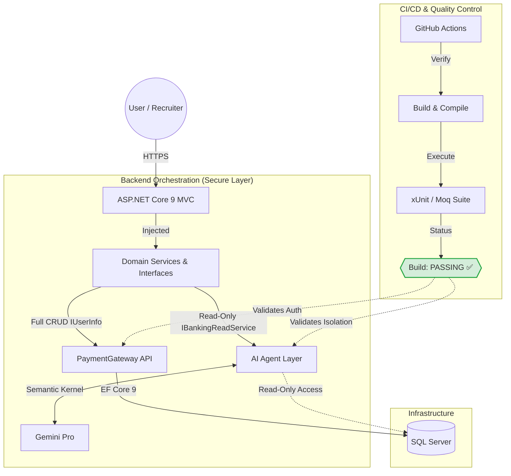

# Distributed Payment Processing System
**Modernized .NET 9 Microservices Architecture**

## 🚀 Project Evolution
This project represents a full-scale modernization of a legacy architecture. I have refactored the codebase from .NET Core 3.1 to **.NET 9**, prioritizing performance, containerization, and modern asynchronous patterns. The solution has been reorganized into a clean `src/` directory structure for better maintainability.

## 🛠️ Tech Stack & Skills
- **Framework:** .NET 9 (Web API & Razor)
- **AI Integration:** Microsoft Semantic Kernel (AI Financial Agent logic)
- **Containerization:** Docker & Docker-Compose (Multi-container orchestration)
- **CI/CD:** GitHub Actions (Automated Build & Test pipelines)
- **Architecture:** Microservices, Repository Pattern, Dependency Injection
- **Database:** SQL Server with Entity Framework Core 9

## 📂 Project Structure
- `src/PaymentGateway.API`: Core processing engine and Merchant logic.
- `src/Payment.ClientView`: The Consumer/User-facing portal.
- `src/AIFinancialService`: AI-driven service for financial insights.
- `src/SharedData`: Shared models and DTOs to ensure type safety across services.
- `src/PaymentProcessing.Tests`: Comprehensive xUnit and Moq suite.

## 🏗️ Architectural Highlights
- **AI-Enhanced:** Leveraging Semantic Kernel to provide intelligent financial analysis within the microservices ecosystem.
- **AI Security & Data Isolation: Implemented the Interface Segregation Principle (ISP) to create a hard boundary for AI interactions. The AI Agent is injected with a restricted IBankingReadService, making it physically impossible for the LLM to execute Delete or Update commands, even if it "hallucinates" a request.
- **Asynchronous Flow:** Fully implemented async/await across the data and service layers to ensure non-blocking I/O.
- **Security:** Implemented custom Middleware for API Key authentication and protection against BOLA (Broken Object Level Authorization).
- **Containerized Environment:** Standardized development using Docker, ensuring seamless transitions between local and cloud environments.
- **Modernized AI Integration: Utilizing Microsoft Semantic Kernel to bridge the gap between Natural Language Processing and structured C# business logic.

### 🛡️ Security & Reliability (xUnit + Moq)
- **BOLA Protection:** Verified via `ReturnsUnauthorized_WhenUserIsNotOwner` across sensitive operations.
- **Data Integrity:** Ensured via `Verify(Times.Never)` to confirm no unauthorized database writes occur.
- **Input Validation:** Strict validation for credit card processing and financial data inputs.

## 📈 Roadmap (Active Dev)
- [x] Refactor UI and API to .NET 9
- [x] Reorganize Solution Architecture (`/src` pattern)
- [x] Dockerize full environment
- [x] Implement xUnit & Moq for Core Logic
- [x] Implement Interface Segregation for AI Safety (Read-Only Plugin)
- [ ] Research RAG (Retrieval-Augmented Generation) for Bank Policy Documentation
- [ ] Integrate AutoMapper for DTO management

